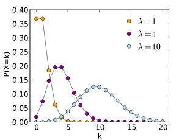

```{r setup, include=FALSE}
knitr::opts_chunk$set(echo = TRUE)
```

## A Disclaimer

:::::: {.columns}
::: {.column}

:::

::: {.column}
 - This is not an invitation to start a language war!

:::
::::::

::: notes

 - The guy in this picture is a French immortal, he is appointed by France to decide what is and isn't part of the French language
 - He gets a cool sword

:::

## Why R?

 - R usually gets statistical packages first.
 - The canonical version of several packages are here.

## Why Python

 - You probably know it already.
 - A strong web development community makes deployment easier.
 - Scikit Learn is really, really good.
 
## But Really, What Language Do I Choose?

 1. The one that you know best
 2. The one your team knows best
 3. The one the community knows best

## What Makes for Smooth Deployment?

1. Reliability
2. Testability
3. Interopterability
4. Auditability

::: notes

 - This is a lot to cover in 5 minutes
 - Make sure you understand why you need to do something in R
 - There are Python versions of each of the things I'm talking about 

:::

## Example: Poisson Regression

:::::: {.columns}
::: {.column}

:::

::: {.column}
 - Trying to predict the number of times something will happen?
 - Use a Poisson Regression
 - There's no Poisson regression in Sci-Kit Learn

:::
::::::

## Example: Prussian Army Horse Kick Deaths 

:::::: {.columns}
::: {.column}

:::

::: {.column}

 - A classic Poisson distribution dataset is the number of Prussian soldiers killed by horses

:::
::::::

::: notes

 - Before you jump and use R ask your deployment team if they have any knowledge

:::

## A Look at the Data (R)

```{r, message = FALSE, warning = FALSE}
library(readr)

horse_kicks <- read_csv("data/VonBort.csv")

tail(horse_kicks)
```

## A Look at the Data (Python)

```{python, engine.path='~/anaconda3/bin/python'}
import pandas as pd

horse_kicks = pd.read_csv("data/VonBort.csv")

print(horse_kicks.tail(5))
```

::: notes

- We only care about deaths, year and corps

:::

## First Pass

```{r, eval = TRUE, message = FALSE, warning=FALSE}
library(dplyr)

model <- glm(deaths ~ year + corps, 
             data = horse_kicks, 
             family = "poisson")

predict_df <- tibble(year = c(1895), 
                     corps = c("I"))

predict(model, predict_df)
```

::: notes

 - Don't worry if you are having difficulty reading this
 - First two lines are imports, then reading in data, building a model
 - Notice that the prediction here is negative!

:::

## Turn Your Code Into a Package

:::::: {.columns}
::: {.column}

:::

::: {.column}
 - Functions go in the `R` directory
 - Tests go in the `tests` directory
 - Gets you access to many builtin checks for code quality 
 - Python equivalent: https://packaging.python.org/

:::
::::::

::: notes

 - I highly recommend writing anything that will be used more than once as a R package

:::

## Reliability

- What happens if instead of predicting the **I** corps, I predict the **1st** corps?
- One erroneous row breaks predictions for the whole data set
- Strictly enforce checks on the data set

::: notes

 - We always make assumptions when we build models, you'll need to write them out
 - A negative result for a Poisson regression may be acceptable when you are fiddling but not in production
 - A great way to enforce these assumptions are through unit tests

:::

## Checking Code (Python)

```{python, eval = FALSE}
def clean_horse_kicks(horse_kick_df: pd.DataFrame) -> pd.DataFrame:
    prussian_corps = {"G", "I", "II", "III", "IV", "V", "VI",
                         "VII", "VIII", "IX", "X", "XI", "XIV", "XV"}

    if not {"year", "corps"}.issubset(horse_kick_df.columns):
        missing_columns = {"year", "corps"} - set(horse_kick_df.columns)
        raise MissingColumnException(f"{missing_columns} not in Data Frame.")
        
    return horse_kick_df.loc[
        corps_known & years_in_bounds,
        ["year", "corps"]
    ]
```

## Checking Code (R)

```{r, eval = FALSE}
clean_horse_kicks <- function(horse_kick_df) {

  horse_kick_df %>%
    verify(
      has_all_names("year", "corps") ,
      error_fun = error_stop) %>%
    assert(
      within_bounds(1701, 1919, allow.na = FALSE), 
      .data$year,
      error_fun = warn_report) %>%
    select(.data$year, .data$corps) %>%
    filter(between(.data$year, 1701, 1919))
}
```

::: notes

 - If you haven't seen tidyverse are before it looks very weird
 - The %>% means pipe, you can think of it as a "then" operator (i.e. verify THEN assert THEN select THE filter)
 - The important part is to sanitize your inputs

:::


## Testability

:::::: {.columns}
::: {.column}

:::

::: {.column}
 - Most R starts it's life as a one-off script
 - This code is rarely tested
 - **Deploying untested code is a very bad idea**

:::
::::::

::: notes
 - Data science bugs are especially bad because so many of them don't crash the system. Instead you get subtle shifts in behavior and your predictiveness goes down
:::


## Testthat

```{r, eval = FALSE}
test_that("clean_horse_kicks removes bad entries", {
  test_df <- dplyr::tibble(
    year = c(1492, 1848, 2019, 1871),
    corps = c("I", "I", "I", "XXIII")
  )

  reference_df <- dplyr::tibble(year = c(1848), corps = c("I"))

  expect_equal(
    expect_warning(clean_horse_kicks(test_df)),
    reference_df
  )
})
```

::: notes
 - This is roughly equivalent to the xUnit framework

:::


## Interopterability

:::::: {.columns}
::: {.column}

:::

::: {.column}
 - The worst bugs of my life have been from trying to call Python from R and vice versa
 - Since our package is so small, why not turn the package into a microservice?
:::
::::::

::: notes
- A microservice is a small package separated from other packages
- This can add complexity to your system
:::

## Defining a Plumber API

```{r, eval = FALSE}
#* Predict the number of horse kick deaths a soldier suffered in a year
#*
#* @json
#* @post /predict
predict <- function(req) {
  horse_kick_df <- jsonlite::fromJSON(req$postBody) %>%
    as_tibble()
  results <- horse_kick_df %>%
    clean_horse_kicks() %>%
    predict_horse_kicks()
  jsonlite::toJSON(results, dataframe = "columns")
}
```

::: notes

This is pretty similar to Flask

:::


## Calling the API


 
::: notes
- If this needs to be faster you could also use protocol buffers
- Even faster? Just rewrite the code in C++
:::

## Auditability

:::::: {.columns}
::: {.column}

:::

::: {.column}
 - Someone asks you why a model from six months ago made a prediction, what would you tell them?
 - You need to have the exact model, package and dependencies available
:::
::::::


## Docker 
```
FROM trestletech/plumber

RUN R -e "install.packages(c('devtools', 'packrat'), repos = 'http://cran.us.r-project.org')"
ADD ./horsekickeR /home/user/horsekickeR
WORKDIR /home/user/horsekickeR
RUN R -e 'devtools::install_deps(dependencies = TRUE, upgrade = "never")'
RUN R -e 'devtools::install()'
EXPOSE 8000
CMD ["Rscript", "exec/plumber.R"]

```

::: notes

I actually made this, you can check it out on GitHub and DockerHub

:::

## Questions?

https://github.com/lstmemery/r-in-production
https://github.com/lstmemery/horsekickeR
https://cloud.docker.com/u/lstmemery/repository/docker/lstmemery/horsekicker

